# 🚀 Terraform Multi-Cloud CI Reusable GitHub Action

        

A reusable GitHub Actions workflow for running Terraform CI pipelines across multiple cloud providers (AWS, GCP, Azure). This workflow performs linting, validation, and planning with support for multiple backend types and authentication methods.

---

## 🧾 Action Description

This GitHub Action provides a reusable workflow that:

- **Multi-cloud support**: Works with AWS, GCP, and Azure infrastructure
- **Terraform linting**: Uses TFLint for code quality checks
- **Terraform validation**: Validates configuration syntax and consistency
- **Terraform planning**: Generates execution plans for infrastructure changes
- **Flexible backends**: Supports S3 and HCP Terraform Cloud backends
- **Secure authentication**: Uses cloud-native authentication methods (IAM roles, Workload Identity, etc.)

### Current Pipeline Steps

1. **🔍 TFLint**: Lints Terraform code for best practices and errors
2. **✅ Validate**: Validates Terraform configuration files
3. **🔍 Plan**: Creates Terraform execution plan

### Planned Enhancements

- Checkov security scanning
- Infracost cost estimation
- Automated release tagging

---

## 🔧 Inputs

| Name             | Description                                                                 | Required | Default               |
|------------------|-----------------------------------------------------------------------------|----------|------------------------|
| `cloud-provider` | Target cloud provider (`aws`, `gcp`, `azure`)                             | ✅ Yes   | —                      |
| `tflint-ver`     | TFLint version to install                                                  | ✅ Yes   | —                      |
| `backend-type`   | Backend type: `s3` for AWS S3 or `remote` for HCP Terraform Cloud         | ❌ No    | `s3`                   |
| `aws-region`     | AWS region for authentication (required when cloud-provider is `aws`)     | ❌ No    | —                      |
| `tf-vars-file`   | Terraform variables file to use                                            | ❌ No    | `terraform.tfvars`     |

### 🔐 Secrets

| Name                    | Description                                                      | Required When           |
|-------------------------|------------------------------------------------------------------|-------------------------|
| `tfc-token`             | HCP Terraform Cloud API token                                   | `backend-type` = `remote` |
| `aws-role-to-assume`    | AWS IAM role ARN to assume                                       | `cloud-provider` = `aws` |
| `gcp-wif-provider`      | GCP Workload Identity Federation provider                        | `cloud-provider` = `gcp` |
| `gcp-service-account`   | GCP service account email for authentication                     | `cloud-provider` = `gcp` |
| `azure-client-id`       | Azure client ID for authentication                               | `cloud-provider` = `azure` |
| `azure-tenant-id`       | Azure tenant ID for authentication                               | `cloud-provider` = `azure` |
| `azure-subscription-id` | Azure subscription ID for authentication                         | `cloud-provider` = `azure` |

---

## 📊 Workflow Overview

```mermaid
flowchart TD
    A[Trigger via workflow_call] --> B[� Validatev Cloud Provider]
    B --> C[⚙️ TFLint]
    C --> D[✅ Terraform Validate]
    D --> E[� Terraforam Plan]
    
    F[Print Inputs] --> B
    
    style C fill:#e1f5fe
    style D fill:#f3e5f5
    style E fill:#fff3e0
```



---

## 💡 Example Usage

### AWS with S3 Backend

```yaml
name: Terraform CI - AWS

on:
  push:
    branches: ['**']
  pull_request:
    branches: [main]

jobs:
  terraform-ci:
    uses: subhamay-bhattacharyya-gha/tf-ci-reusable-wf/.github/workflows/ci.yaml@main
    with:
      cloud-provider: aws
      tflint-ver: "v0.50.0"
      backend-type: s3
      aws-region: us-east-1
      tf-vars-file: terraform.tfvars
    secrets:
      aws-role-to-assume: ${{ secrets.AWS_ROLE_ARN }}
```

### GCP with HCP Terraform Cloud Backend

```yaml
name: Terraform CI - GCP

on:
  push:
    branches: ['**']
  pull_request:
    branches: [main]

jobs:
  terraform-ci:
    uses: subhamay-bhattacharyya-gha/tf-ci-reusable-wf/.github/workflows/ci.yaml@main
    with:
      cloud-provider: gcp
      tflint-ver: "v0.50.0"
      backend-type: remote
      tf-vars-file: gcp.tfvars
    secrets:
      tfc-token: ${{ secrets.TFC_TOKEN }}
      gcp-wif-provider: ${{ secrets.GCP_WIF_PROVIDER }}
      gcp-service-account: ${{ secrets.GCP_SERVICE_ACCOUNT }}
```

### Azure with S3 Backend

```yaml
name: Terraform CI - Azure

on:
  push:
    branches: ['**']
  pull_request:
    branches: [main]

jobs:
  terraform-ci:
    uses: subhamay-bhattacharyya-gha/tf-ci-reusable-wf/.github/workflows/ci.yaml@main
    with:
      cloud-provider: azure
      tflint-ver: "v0.50.0"
      backend-type: s3
      tf-vars-file: azure.tfvars
    secrets:
      azure-client-id: ${{ secrets.AZURE_CLIENT_ID }}
      azure-tenant-id: ${{ secrets.AZURE_TENANT_ID }}
      azure-subscription-id: ${{ secrets.AZURE_SUBSCRIPTION_ID }}
```

## 🏗️ Directory Structure

The workflow expects your repository to follow this structure:

```
your-repo/
├── infra/
│   ├── aws/
│   │   └── tf/          # AWS Terraform files
│   ├── gcp/
│   │   └── tf/          # GCP Terraform files
│   └── azure/
│       └── tf/          # Azure Terraform files
└── .github/
    └── workflows/
        └── main.yaml    # Your workflow that calls this reusable workflow
```

## License

MIT
