# 🚀 Terraform Multi-Cloud CI Reusable GitHub Action

&nbsp;&nbsp;&nbsp;&nbsp;&nbsp;&nbsp;&nbsp;&nbsp;

A reusable GitHub Actions workflow for running Terraform CI pipelines across multiple cloud providers and platforms (AWS, GCP, Azure, Snowflake, Databricks). This workflow performs linting, validation, and planning with support for multiple backend types, authentication methods, and a special **platform mode** for multi-cloud deployments.

---

## 🧾 Action Description

This GitHub Action provides a reusable workflow that:

- **Multi-cloud support**: Works with AWS, GCP, Azure, Snowflake, and Databricks infrastructure
- **Platform mode**: Run CI across all detected cloud providers in a single workflow
- **Terraform linting**: Uses TFLint for code quality checks
- **Terraform validation**: Validates configuration syntax and consistency
- **Terraform planning**: Generates execution plans for infrastructure changes
- **Flexible backends**: Supports S3 and HCP Terraform Cloud backends
- **Secure authentication**: Uses cloud-native authentication methods (IAM roles, Workload Identity, etc.)
- **Input validation**: Validates all required inputs and secrets before execution

### Current Pipeline Steps

1. **📋 Print Inputs**: Displays all workflow inputs for debugging
2. **✅ Validate Input Configuration**: Validates backend-type, cloud-provider, and required credentials
3. **⚙️ TFLint**: Lints Terraform code for best practices and errors
4. **✅ Validate**: Validates Terraform configuration files
5. **🔍 Plan**: Creates Terraform execution plan

### Planned Enhancements

- Checkov security scanning
- Infracost cost estimation
- Automated release tagging

---

## 🔧 Inputs

| Name                    | Description                                                                 | Required | Default               |
|-------------------------|-----------------------------------------------------------------------------|----------|------------------------|
| `cloud-provider`        | Target cloud provider or platform (`aws`, `gcp`, `azure`, `snowflake`, `databricks`, `platform`) | ✅ Yes   | —                      |
| `tflint-ver`            | TFLint version to install                                                  | ✅ Yes   | —                      |
| `backend-type`          | Backend type: `s3` for AWS S3 or `remote` for HCP Terraform Cloud         | ❌ No    | `s3`                   |
| `s3-bucket`             | S3 bucket name for Terraform state (required when backend-type is `s3`)   | ❌ No    | —                      |
| `s3-region`             | AWS region for S3 bucket (required when backend-type is `s3`)             | ❌ No    | —                      |
| `s3-key-prefix`         | S3 key prefix for Terraform state file (required when backend-type is `s3`) | ❌ No  | —                      |
| `aws-region`            | AWS region for authentication (required when cloud-provider is `aws`)     | ❌ No    | —                      |
| `snowflake-account`     | Snowflake account identifier (required when cloud-provider is `snowflake`) | ❌ No   | —                      |
| `snowflake-user`        | Snowflake user name (required when cloud-provider is `snowflake`)         | ❌ No    | —                      |
| `snowflake-role`        | Snowflake role name (required when cloud-provider is `snowflake`)         | ❌ No    | —                      |
| `terraform-dir`         | Directory containing Terraform configuration files relative to cloud provider path | ❌ No | `tf`                   |
| `tf-vars-file`          | Terraform variables file to use                                            | ❌ No    | `terraform.tfvars`     |

### 🔐 Secrets

| Name                    | Description                                                      | Required When           |
|-------------------------|------------------------------------------------------------------|-------------------------|
| `tfc-token`             | HCP Terraform Cloud API token                                   | `backend-type` = `remote` |
| `aws-role-to-assume`    | AWS IAM role ARN to assume                                       | `cloud-provider` = `aws` |
| `gcp-wif-provider`      | GCP Workload Identity Federation provider                        | `cloud-provider` = `gcp` |
| `gcp-service-account`   | GCP service account email for authentication                     | `cloud-provider` = `gcp` |
| `snowflake-private-key` | Snowflake private key for authentication                         | `cloud-provider` = `snowflake` |
| `databricks-host`       | Databricks workspace URL                                         | `cloud-provider` = `databricks` |
| `databricks-token`      | Databricks personal access token                                 | `cloud-provider` = `databricks` |
| `azure-client-id`       | Azure client ID for authentication                               | `cloud-provider` = `azure` |
| `azure-tenant-id`       | Azure tenant ID for authentication                               | `cloud-provider` = `azure` |
| `azure-subscription-id` | Azure subscription ID for authentication                         | `cloud-provider` = `azure` |

---

## 📊 Workflow Overview

```mermaid
flowchart TD
    A[Trigger via workflow_call] --> B[📋 Print Inputs]
    B --> C[✅ Validate Input Configuration]
    C --> D{cloud-provider}
    
    D -->|Single Provider| E[⚙️ TFLint]
    D -->|Platform Mode| F[⚙️ TFLint - All Providers]
    
    E --> G[✅ Terraform Validate]
    F --> H[✅ Terraform Validate - All Providers]
    
    G --> I[🔍 Terraform Plan]
    H --> J[🔍 Terraform Plan - All Providers]
    
    style C fill:#e8f5e9
    style E fill:#e1f5fe
    style F fill:#e1f5fe
    style G fill:#f3e5f5
    style H fill:#f3e5f5
    style I fill:#fff3e0
    style J fill:#fff3e0
```



---

## 🌐 Platform Mode

When `cloud-provider` is set to `platform`, the workflow automatically detects and processes all cloud provider directories found in `infra/`. This is useful for multi-cloud deployments where you want to run CI across all providers in a single workflow.

### How Platform Mode Works

1. **Detection**: The workflow checks for the existence of `infra/{provider}/tf` directories
2. **Validation**: Only validates inputs for detected providers
3. **Execution**: Runs TFLint, Validate, and Plan for each detected provider

### Platform Mode Example

```yaml
name: Terraform CI - Platform

on:
  push:
    branches: ['**']
  pull_request:
    branches: [main]

jobs:
  terraform-ci:
    uses: subhamay-bhattacharyya-gha/tf-ci-reusable-wf/.github/workflows/ci.yaml@main
    with:
      cloud-provider: platform
      tflint-ver: "v0.50.0"
      backend-type: s3
      s3-bucket: "my-terraform-state-bucket"
      s3-region: "us-east-1"
      s3-key-prefix: "terraform/state"
      aws-region: us-east-1
      snowflake-account: "my-account"
      snowflake-user: "terraform_user"
      snowflake-role: "TERRAFORM_ROLE"
    secrets:
      aws-role-to-assume: ${{ secrets.AWS_ROLE_ARN }}
      gcp-wif-provider: ${{ secrets.GCP_WIF_PROVIDER }}
      gcp-service-account: ${{ secrets.GCP_SERVICE_ACCOUNT }}
      azure-client-id: ${{ secrets.AZURE_CLIENT_ID }}
      azure-tenant-id: ${{ secrets.AZURE_TENANT_ID }}
      azure-subscription-id: ${{ secrets.AZURE_SUBSCRIPTION_ID }}
      snowflake-private-key: ${{ secrets.SNOWFLAKE_PRIVATE_KEY }}
      databricks-host: ${{ secrets.DATABRICKS_HOST }}
      databricks-token: ${{ secrets.DATABRICKS_TOKEN }}
```

---

## 💡 Example Usage

### AWS with S3 Backend

```yaml
name: Terraform CI - AWS

on:
  push:
    branches: ['**']
  pull_request:
    branches: [main]

jobs:
  terraform-ci:
    uses: subhamay-bhattacharyya-gha/tf-ci-reusable-wf/.github/workflows/ci.yaml@main
    with:
      cloud-provider: aws
      tflint-ver: "v0.50.0"
      backend-type: s3
      s3-bucket: "my-terraform-state-bucket"
      s3-region: "us-east-1"
      s3-key-prefix: "aws/terraform"
      aws-region: us-east-1
      tf-vars-file: terraform.tfvars
    secrets:
      aws-role-to-assume: ${{ secrets.AWS_ROLE_ARN }}
```

### GCP with HCP Terraform Cloud Backend

```yaml
name: Terraform CI - GCP

on:
  push:
    branches: ['**']
  pull_request:
    branches: [main]

jobs:
  terraform-ci:
    uses: subhamay-bhattacharyya-gha/tf-ci-reusable-wf/.github/workflows/ci.yaml@main
    with:
      cloud-provider: gcp
      tflint-ver: "v0.50.0"
      backend-type: remote
      tf-vars-file: gcp.tfvars
    secrets:
      tfc-token: ${{ secrets.TFC_TOKEN }}
      gcp-wif-provider: ${{ secrets.GCP_WIF_PROVIDER }}
      gcp-service-account: ${{ secrets.GCP_SERVICE_ACCOUNT }}
```

### Azure with S3 Backend

```yaml
name: Terraform CI - Azure

on:
  push:
    branches: ['**']
  pull_request:
    branches: [main]

jobs:
  terraform-ci:
    uses: subhamay-bhattacharyya-gha/tf-ci-reusable-wf/.github/workflows/ci.yaml@main
    with:
      cloud-provider: azure
      tflint-ver: "v0.50.0"
      backend-type: s3
      s3-bucket: "my-terraform-state-bucket"
      s3-region: "us-east-1"
      s3-key-prefix: "azure/terraform"
      tf-vars-file: azure.tfvars
    secrets:
      azure-client-id: ${{ secrets.AZURE_CLIENT_ID }}
      azure-tenant-id: ${{ secrets.AZURE_TENANT_ID }}
      azure-subscription-id: ${{ secrets.AZURE_SUBSCRIPTION_ID }}
```

### Snowflake with S3 Backend

```yaml
name: Terraform CI - Snowflake

on:
  push:
    branches: ['**']
  pull_request:
    branches: [main]

jobs:
  terraform-ci:
    uses: subhamay-bhattacharyya-gha/tf-ci-reusable-wf/.github/workflows/ci.yaml@main
    with:
      cloud-provider: snowflake
      tflint-ver: "v0.50.0"
      backend-type: s3
      s3-bucket: "my-terraform-state-bucket"
      s3-region: "us-east-1"
      s3-key-prefix: "snowflake/terraform"
      snowflake-account: "my-account"
      snowflake-user: "terraform_user"
      snowflake-role: "TERRAFORM_ROLE"
      tf-vars-file: snowflake.tfvars
    secrets:
      snowflake-private-key: ${{ secrets.SNOWFLAKE_PRIVATE_KEY }}
```

### Databricks with S3 Backend

```yaml
name: Terraform CI - Databricks

on:
  push:
    branches: ['**']
  pull_request:
    branches: [main]

jobs:
  terraform-ci:
    uses: subhamay-bhattacharyya-gha/tf-ci-reusable-wf/.github/workflows/ci.yaml@main
    with:
      cloud-provider: databricks
      tflint-ver: "v0.50.0"
      backend-type: s3
      s3-bucket: "my-terraform-state-bucket"
      s3-region: "us-east-1"
      s3-key-prefix: "databricks/terraform"
      tf-vars-file: databricks.tfvars
    secrets:
      databricks-host: ${{ secrets.DATABRICKS_HOST }}
      databricks-token: ${{ secrets.DATABRICKS_TOKEN }}
```

---

## 🏗️ Directory Structure

The workflow expects your repository to follow this structure:

```
your-repo/
├── infra/
│   ├── aws/
│   │   └── tf/          # AWS Terraform files
│   ├── gcp/
│   │   └── tf/          # GCP Terraform files
│   ├── azure/
│   │   └── tf/          # Azure Terraform files
│   ├── snowflake/
│   │   └── tf/          # Snowflake Terraform files
│   └── databricks/
│       └── tf/          # Databricks Terraform files
└── .github/
    └── workflows/
        └── main.yaml    # Your workflow that calls this reusable workflow
```

---

## 🔒 Input Validation

The workflow performs comprehensive input validation before execution:

### Backend Validation
- Validates `backend-type` is either `s3` or `remote`
- For S3 backend: Requires `s3-bucket` and `s3-region`
- For remote backend: Requires `tfc-token` secret

### Cloud Provider Validation
- **AWS**: Requires `aws-region` and `aws-role-to-assume`
- **GCP**: Requires `gcp-wif-provider` and `gcp-service-account`
- **Azure**: Requires `azure-client-id`, `azure-tenant-id`, and `azure-subscription-id`
- **Snowflake**: Requires `snowflake-account`, `snowflake-user`, `snowflake-role`, and `snowflake-private-key`
- **Databricks**: Requires `databricks-host` and `databricks-token`
- **Platform**: Validates inputs only for detected provider directories

---

## 🛠️ Actions Used

| Action | Description |
|--------|-------------|
| `subhamay-bhattacharyya-gha/tf-lint-action@main` | TFLint for Terraform code quality |
| `subhamay-bhattacharyya-gha/tf-validate-action@main` | Terraform configuration validation |
| `subhamay-bhattacharyya-gha/tf-plan-action@main` | Terraform plan execution |
| `actions/checkout@v4` | Repository checkout (platform mode) |

---

## License

MIT
