# 🚀 Terraform CI/CD Reusable GitHub Action

        

A reusable GitHub Actions workflow for running full CI/CD pipelines on Terraform-based infrastructure. This composite workflow performs validation, linting, cost estimation, metadata tagging, and resource builds with support for AWS and Infracost integrations.

---

## 🧾 Action Description

This GitHub Action:

- Detects infrastructure and service changes
- Performs security scans and IaC checks (Checkov, TFLint)
- Tags Terraform resources using Yor
- Executes Terraform commands (init, validate, plan, apply, destroy)
- Estimates infrastructure cost with Infracost
- Builds packages for Lambda, Glue, Step Functions (if applicable)

---

## 🔧 Inputs

| Name             | Description                                                                 | Required | Default               |
|------------------|-----------------------------------------------------------------------------|----------|------------------------|
| `environment`     | Environment to deploy to (`ci`, `devl`, `test`, `prod`)                    | ✅ Yes   | —                      |
| `terraform-dir`   | Directory containing Terraform configuration files                         | ✅ Yes   | `tf`                   |
| `tf-vars-file`    | Terraform variables file to use                                            | ❌ No    | `terraform.tfvars`     |
| `ci-pipeline`     | Whether this is a CI pipeline run                                          | ❌ No    | `true`                 |

### 🔐 Secrets

| Name                 | Description                                 | Required |
|----------------------|---------------------------------------------|----------|
| `aws-role-arn`       | AWS role ARN to assume                      | ✅ Yes   |
| `infracost-api-key`  | API key for Infracost                       | ✅ Yes   |
| `infracost-gist-id`  | Gist ID to store Infracost results          | ✅ Yes   |

---

## 📊 Workflow Overview (Mermaid)

```mermaid
flowchart TD
    A[Trigger via workflow_call] --> B[🔎 Check Environments]
    A --> C[🔎 Detect Changes]
    A --> D[🔎 Detect Services]
    A --> E[🔎 Check Branch Issue]
    B & C & D & E --> F[🧠 Determine Execution Path]
    
    F --> G{Contains IaC?}
    G -- Yes --> H[✔️ Terraform Validate]
    G -- Yes --> I[📋 Terraform Lint]
    G -- Yes --> J[🧳 Checkov Scan]
    G -- Yes --> K[📋 Yor Tagging]
    K --> L[📋 Terraform Plan]
    L --> M[💰 Infracost]
    M --> N[🚧 Terraform Apply]
    N --> O[✂️ Terraform Destroy]

    F --> P{Builds Required?}
    P -- Lambda --> Q[🛠️ Lambda Package]
    P -- Lambda Layer --> R[🛠️ Lambda Layer]
    P -- Glue --> S[🛠️ Glue Script]
    P -- Step Function --> T[🛠️ State Machine]

    Q & R & S & T & O --> U[🚀 Create Pull Request]
```



---

## Example Usage

```yaml
name: Terraform CI

on:
  pull_request:
    branches:
      - main

jobs:
  call-terraform-ci:
    uses: subhamay-bhattacharyya-gha/tf-ci-reusable-wf/.github/workflows/ci.yaml@main
    with:
      environment: devl
      terraform-dir: tf
      tf-vars-file: dev.tfvars
      ci-pipeline: true
    secrets:
      aws-role-arn: ${{ secrets.AWS_ROLE_ARN }}
      infracost-api-key: ${{ secrets.INFRACOST_API_KEY }}
      infracost-gist-id: ${{ secrets.INFRACOST_GIST_ID }}

```

## License

MIT
